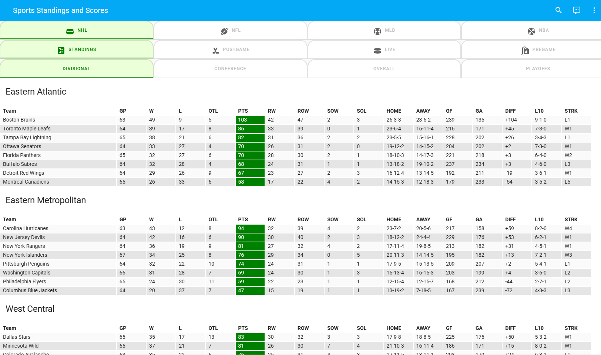
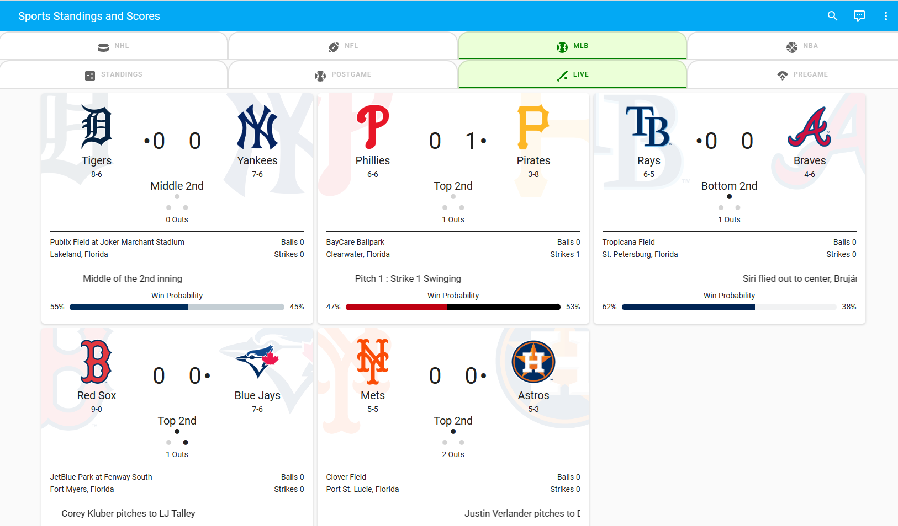

# Sport Standings and Scores

This project has Sports Standings and Scores Sensors and Dashboard for Home Assistant.
It contains NHL, NFL, MLB and NBA standings as well as pre-game, in-game and post-game statistics.
It makes use of the ESPN APIs as well as the great Teamtracker Home Assistant App and Card.

## Final Result

I always like to give you a glance at what you are building first. 
This helps you to understand the components and what goes into the solution. 
What we are building is shown here in the following images:

NHL Standings by Division



MLB Live Games



There are several components in this interface.
Across the top it uses tabs to allow selection of what you want to see:

- Select the Sport (NHL, MLB, NFL or NBA)
- Standings has Divisonal, Conference and Overall standings for each sport
- Note: the current view also has Playoff/Wildcard placeholder yet to be done
- Each sport has post-game, in-game and pre-game display

## Prerequisites

As for the GUI, there are of course some standard cards like horizontal-stack and vertical-stack. But there are also several custom cards used. These include:

- [Teamtracker](https://github.com/vasqued2/ha-teamtracker)
- [Flex-Table](https://github.com/custom-cards/flex-table-card)
- [Layout](https://github.com/thomasloven/lovelace-layout-card)
- [Mod](https://github.com/thomasloven/lovelace-card-mod)
- [Tabbed](https://github.com/kinghat/tabbed-card)
- [Stack-in](https://github.com/custom-cards/stack-in-card)
- [Decluttering](https://github.com/custom-cards/decluttering-card)

If you want the solution to work as is, you will need to be sure you have these installed and working in your Lovelace configuration.

## Sensors

There are several sensors. 
The main sensors can be broken down into two types.
The first is a single sensor for every sport that uses REST. 
These are in the Git sensr.yaml file.
One example is:


```
##
## NFL Standings
##
- platform: rest
  scan_interval: 36000
  name: NFL Standings
  unique_id: sensor.nfl_standings
  resource: https://site.web.api.espn.com/apis/v2/sports/football/nfl/standings?seasontype=2&type=0&level=3
  value_template: "{{ now() }}"
  json_attributes:
      - children
```

The other sensors in sensor.yaml are all teamtracker sensors for every team in all our sports.
A short example is like this:

```
##
##  NFL Teams
##
- platform: teamtracker
  league_id: NFL
  team_id: DET
  name: Detroit Lions
- platform: teamtracker
  league_id: NFL
  team_id: GB
  name: Green Bay
- platform: teamtracker
  league_id: NFL
  team_id: CHI
  name: Chicago Bears
- platform: teamtracker
  league_id: NFL
  team_id: MIN
  name: Minnesota Vikings
- platform: teamtracker
  league_id: NFL
  team_id: BUF
  name: Buffalo Bills
- platform: teamtracker
  league_id: NFL
  team_id: MIA
  name: Miami Dolphins
```

As a side note, I makde these not by typing in every team. I use a tool to go JSON to XML.
The repository includes an XSL that can build the set based on the sensor for a sport.

In order to get standings for all the divisions, I implemented template sensors for all of them.
These are included in template.yaml in Git.
A short sample is like this:


```
###
### NHL Divisions
###
  - name: NHL East Atlantic
    unique_id: sensor.nhl_east_atlantic
    state: "{{ now() }}"
    attributes:
      entries: "{{ state_attr('sensor.nhl_standings','children')[0]['children'][0]['standings']['entries'] }}"
  - name: NHL East Metropolitan
    unique_id: sensor.nhl_east_metropolitan
    state: "{{ now() }}"
    attributes:
      entries: "{{ state_attr('sensor.nhl_standings','children')[0]['children'][1]['standings']['entries'] }}"
  - name: NHL West Central
    unique_id: sensor.nhl_west_central
    state: "{{ now() }}"
    attributes:
      entries: "{{ state_attr('sensor.nhl_standings','children')[1]['children'][0]['standings']['entries'] }}"
  - name: NHL West Pacific
    unique_id: sensor.nhl_west_pacific
    state: "{{ now() }}"
    attributes:
      entries: "{{ state_attr('sensor.nhl_standings','children')[1]['children'][1]['standings']['entries'] }}"
```

## The Dashboard

The complete dashboard is contained in dashboard.yaml. 
You can examine that if and make changes you may want.
It makes extensive use of decluttering to templatize things and make it easier and much shorter to write.
It uses flex-table to show standings. 
There is a help_template in a .txt file that can help you identify the fields that contain the columns you wish to show in standings.

There are a few nice things done with card-mod to implement nicer tabs, colorize active tabs and provide scrolling tables horizontally on smaller displays.

